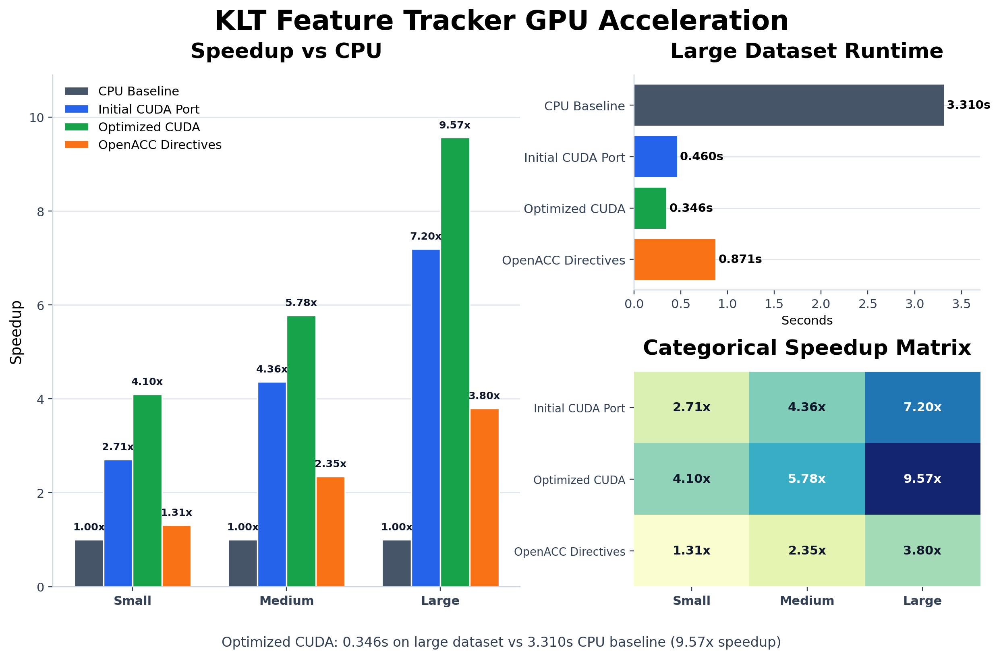
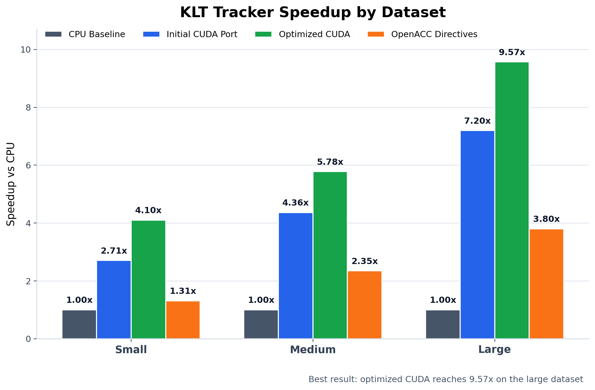
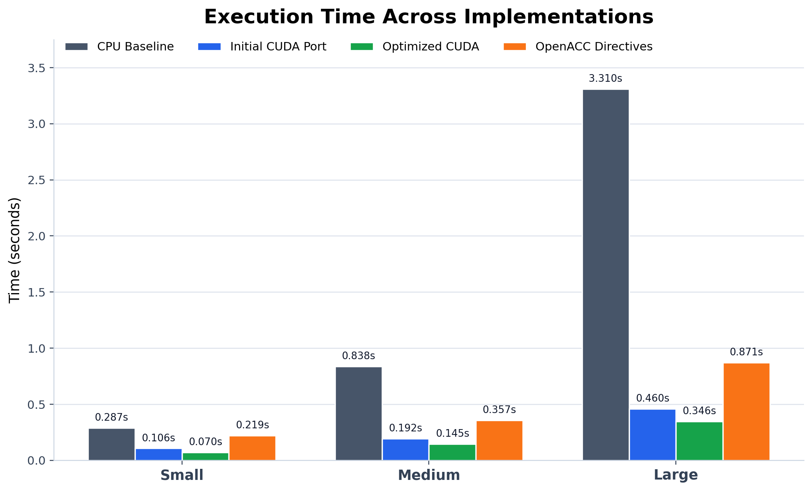
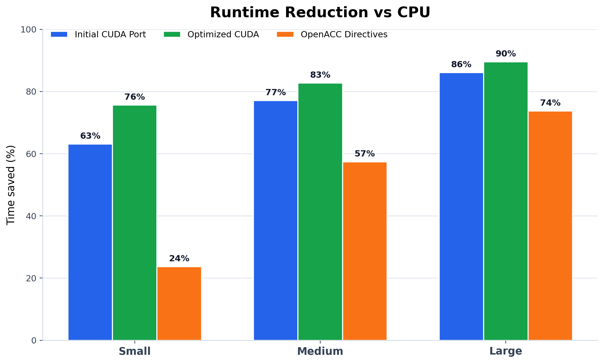
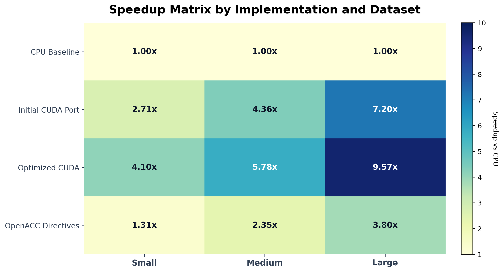

# KLT feature tracker: CPU to GPU

Taking Birchfield's KLT 1.3.4 feature tracker from a single-threaded C baseline to a CUDA pipeline, one deliverable at a time, then comparing against an OpenACC port of the same code. Built for CS 4110 (High Performance Computing with GPUs) by Rayyan Imran, Imaad Fazal and Saleh Mubashar, on an RTX 3080 server.



On the large dataset the optimized CUDA version runs in 0.346 s against 3.310 s on the CPU, a 9.57× speedup. The naive port already gets 7.20×, and OpenACC directives get 3.80×.

## Versions

Each version sits in its own folder so they can be diffed against each other, and each was added in its own commit. The per-version READMEs cite the functions that changed and list everything that was tried.

| Version | What it is |
|---|---|
| [V1](src/V1/) | Original CPU code. gprof put 86% of runtime in `_convolveSeparate` |
| [V2](src/V2/) | Naive CUDA port of the separable convolution; 97% of GPU time went to per-call allocation and copies |
| [V3](src/V3/) | Shared-memory tiled kernels, images kept resident on the GPU with valid flags, feature selection and tracking ported to CUDA |
| [V4](src/V4/) | OpenACC port of V1: convolution and eigenvalue scoring offloaded with directives, tracking left on the host |

## Results

Final end-to-end runtimes on three datasets. In the graphs, "Initial CUDA Port" is V2, "Optimized CUDA" is V3 and "OpenACC Directives" is V4.

| Dataset | CPU (V1) | Naive CUDA (V2) | Optimized CUDA (V3) | OpenACC (V4) |
|---|---|---|---|---|
| Small | 0.287 s | 0.106 s (2.71×) | 0.070 s (4.10×) | 0.219 s (1.31×) |
| Medium | 0.838 s | 0.192 s (4.36×) | 0.145 s (5.78×) | 0.357 s (2.35×) |
| Large | 3.310 s | 0.460 s (7.20×) | 0.346 s (9.57×) | 0.871 s (3.80×) |



Every GPU version gains more as the input grows. That pattern fits fixed per-call costs (allocation, transfers, kernel launches) taking a larger share of a small run.







OpenACC lands at about 40% of the hand-written CUDA speedup on the large set. That fits what the code shows: V4 offloads convolution and eigenvalue scoring but copies data in and out on every convolution call and leaves feature tracking on the CPU, while V3 keeps images on the device across stages and runs tracking one thread per feature.

The per-version READMEs also report narrower measurements taken during each deliverable. These are not the same benchmark as the table above:
- V2's 8.94× is accumulated convolution time only, over 275 frames.
- V3's 31.0 s → 3.7 s is a single wall-clock run of the 275-frame, 1,000-feature driver.

## Repository layout

```
src/V1..V4/      source for each version, with its own README and Makefile
reports/D1/      profiling report, each member's gprof output and call graph
reports/D2/      performance report, timing logs, the two alternative V2 kernels
reports/D3/      Nsight Systems trace, gprof run, timing script and output, demo videos
plots/           graphs above and the script that draws them (python3 plots/make_graphs.py)
```

V1 and V4 build with `make` (`gcc` for V1; `nvc` from the NVIDIA HPC SDK for V4's OpenACC build). V2 and V3 need `nvcc`; the Makefiles target `sm_86`. The 1920×1070 frame sequences used for benchmarking are not included; V4 ships the 320×240 KLT sample frames.

The original KLT code is public domain; see [KLT_ORIGINAL_README.txt](KLT_ORIGINAL_README.txt).
